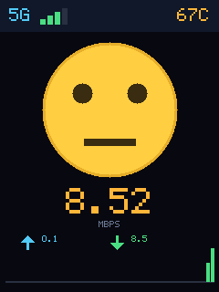

# 随身 WiFi 网速表情屏

把一台**随身 WiFi（5G MiFi）自带的小 LCD** 变成实时网速表情屏。

屏幕上的脸会跟着网速变：

| 状态 | 触发条件 | 表情 |
| --- | --- | --- |
| 😴 瞌睡 | 上下行都 < 0.05 Mbps | 闭眼 + 飘 Z |
| 😢 难过 | 下行 < 2 Mbps | 含泪滴 |
| 🙂 平静 | 下行 2 ~ 10 Mbps | 微笑 |
| 😄 开心 | 下行 ≥ 10 Mbps | 大笑 |

屏幕还带：左上角 5G 信号格数、右上角 SoC 温度、中间实时速率、底部上下行箭头 + 速率历史柱状图。




---

## 跑在什么设备上

一台国产 5G 随身 WiFi，摸出来的底细：

- SoC：**Unisoc UDX710**（展锐 5G 方案），204MB RAM
- 系统：**BusyBox Linux 4.14.98 aarch64**（Yocto sumo），不是 Android
- LCD：`/dev/fb0`，**240×320，RGB565，stride 480**，全屏 153600 字节
- 原厂 UI：`/usr/bin/lcd -platform linuxfb`（Qt 写的时钟界面），启动脚本 `/etc/init.d/lcd-init`
- **`adb connect 192.168.0.1:5555` 免认证直接给 root**（uid=0）

`face.py` 只用设备自带 Python 2.7 的 `os / sys / time / struct / signal`，
**零第三方依赖**。设备的 Python 是精简版，**没有 array / math / mmap / base64**，
所以代码里：画圆用 `dx²+dy²<=r²` 避开 math，打包像素用
`''.join([chr(v&255)+chr(v>>8) for v in buf])` 避开 array。

---

## 怎么跑

电脑上装好 adb，把 `face-control.bat` 里的 `ADB` 路径改成你自己的，然后双击：

```
1 . Start   启动表情屏（会挂一个最小化的 adb 窗口）
2 . Stop    停止，还原原厂时钟界面
3 . Status  看当前状态
4 . Fix Screen   黑屏 / 按键失灵时的一键急救
```

**Start 之后不要关那个最小化的 adb 窗口** —— 它就是表情屏的命。

不想开菜单也行：

```bash
# 启动（这条会一直阻塞，保持它别关）
adb -s 192.168.0.1:5555 shell "python /mnt/data/face.py"

# 停止
adb -s 192.168.0.1:5555 shell "pkill -f '[f]ace.py'; kill -CONT $(pidof lcd)"
```

---

## 原理：怎么在别人家的 UI 上画画

不抢屏幕，**共存**。

实测发现原厂 `lcd` **不会周期性重绘 framebuffer** —— 往 `/dev/fb0` 写一整屏纯色，
75 秒后 md5 纹丝不动；它只在**分钟跳变**时局部重绘时钟那一小块。
所以 `face.py` 每秒往 `/dev/fb0` 写一帧，就把时钟盖住了；
万一表情屏挂了，屏幕只是停在最后一帧，**按一下电源键 `lcd` 就把时钟画回来**，
设备始终可用。

背光不是标准的 `/sys/class/backlight/`（那个目录是空的），而是一个 GPIO 节点：

```
/sys/devices/platform/soc/soc:ap-apb/24700000.spi/spi_master/spi0/spi0.0/bl_gpio
```

`echo 1 >` 开、`echo 0 >` 关。`face.py` 每 5 秒兜底重写一次，防止被别的东西关掉。

---

## ⚠️ 踩过的坑（血泪版）

### 1. `adb shell "cmd &"` 启动的进程**必死**

adb 会话一结束，设备端进程就被回收。`setsid`、`nohup`、双 fork **全都救不了**
（实测 `setsid sleep 300` 也活不过 3 秒）。

所以想常驻只有两条路：

- **A（本项目采用，零风险）**：电脑端 `start "" /min adb.exe -s IP shell "python ..."`
  挂住会话。电脑开着就一直显示。
- **B**：`mount -o remount,rw /` 后加 `/etc/init.d/` 脚本 + `/etc/rc5.d/S99xx` 软链，
  真正开机自启、不依赖电脑。但 `/` 是只读 ubifs，要改系统分区。

### 2. `pkill -f` 会把自己杀掉

```bash
# ❌ 这条命令永远跑不到 kill -CONT：shell 自己的 cmdline 里含 "face.py"，
#    pkill -f face.py 把执行它的 shell 一起杀了
adb shell "pkill -f face.py; kill -CONT \$(pidof lcd)"

# ✅ 用 [f] 规避自匹配
adb shell "pkill -f '[f]ace.py'; kill -CONT \$(pidof lcd)"
```

而且**清理旧进程和启动新进程必须拆成两次 adb 调用** —— 写在同一条命令里时，
命令行会同时含 `[f]ace.py` 和真实的 `/mnt/data/face.py`，`[f]` 那招就失效了。

### 3. 千万不要对 `lcd` 用 `kill -STOP`

早期版本为了让表情屏独占屏幕，启动时 `kill -STOP lcd` 把它暂停。
结果进程被 adb 回收后没能 `kill -CONT` 回来，`lcd` 永远卡在 `T` 状态，
它的息屏定时器又把背光写成了 0 —— **屏幕全黑 + 按键完全没反应**，
看起来像设备坏了。而且这台设备**没有 lcd 看门狗**，`lcd` 死了只能重启设备。

现在 `face.py` 默认**不碰 `lcd`**，只有显式传 `--own` 才接管（不推荐）。

### 4. 退出后画面不会自动还原

因为 `lcd` 只做局部重绘，表情屏停了之后屏幕会**停在最后一帧**。
所以 `Stop` / `Fix` 里会把原厂时钟的原始帧写回去：

```bash
adb shell "dd if=/mnt/data/fb.raw of=/dev/fb0 bs=1024 count=150"
```

`/mnt/data/fb.raw` 是原厂时钟界面的原始 framebuffer 备份（153600 字节），
第一次连上设备时抓的，建议自己也在设备上留一份。

---

## 文件

| 文件 | 说明 |
| --- | --- |
| `face.py` | 表情屏本体，部署到设备 `/mnt/data/face.py`，Python 2.7 零依赖 |
| `face-control.bat` | 电脑端控制面板：启动 / 停止 / 状态 / 修屏 |
| `screen-fix.bat` | 黑屏时的一键急救（恢复 `lcd` + 背光 + 时钟画面） |
| `preview-*.png` | 各状态预览图 |

部署：

```bash
adb -s 192.168.0.1:5555 push face.py /mnt/data/face.py
```

---

## 安全提醒

这台设备的出厂配置是 **WiFi 密码 `12345678` + 开放 ADB 5555 端口**。
同一个网段下任何人都能 `adb connect` 上去免密拿到 root，
等于设备的完全控制权。**强烈建议改掉密码并关掉 5555。**
