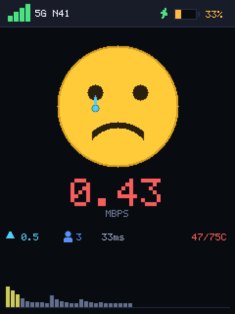
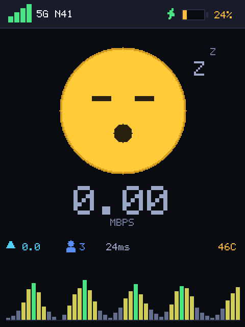
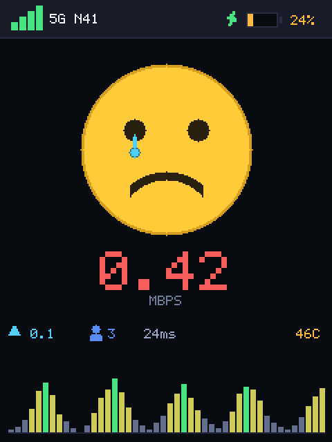
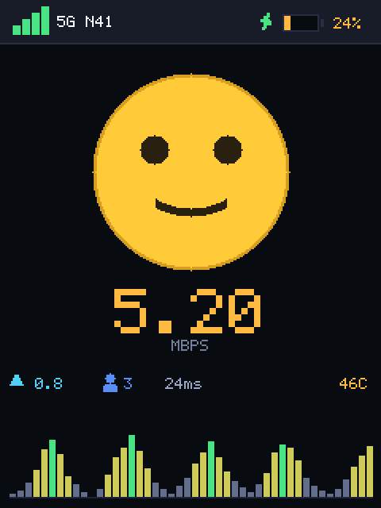
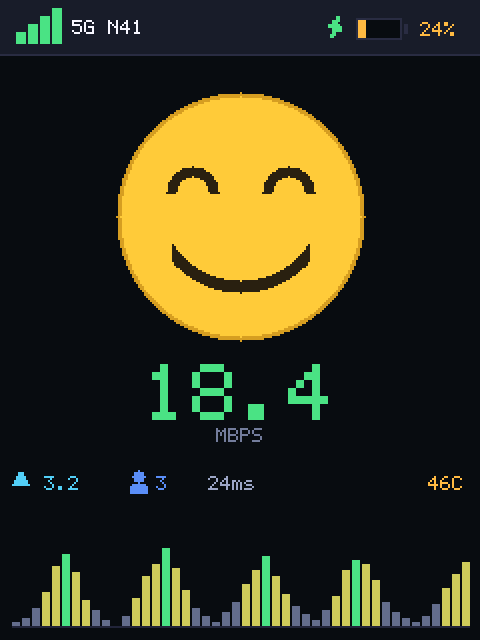
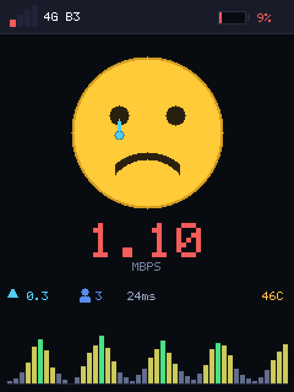
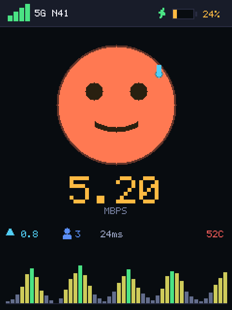
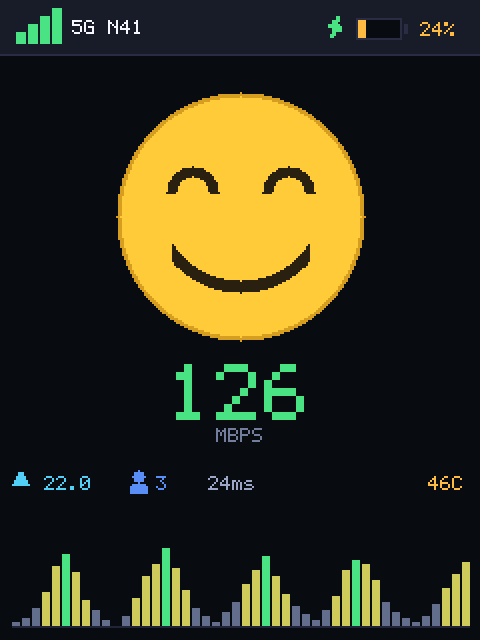
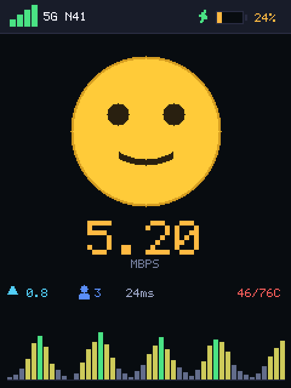

# 网速表情屏 · MiFi Face Screen

把一台 **Unisoc UDX710 随身 WiFi**（展锐 5G 方案，非 Android）上那块 240×320 的小屏，
变成一块会跟着网速变表情的实时仪表盘。

```
网速快  →  闭眼大笑        😄
网速正常 →  微笑            🙂
网速慢  →  皱眉 + 泪滴      😢
没流量  →  睡着了 + Z z     😴
机器过热 →  脸变红 + 冒汗    🥵
SoC 降频 →  温度标红告警
```



---

## 为什么会有这个

原厂 UI 就是**一块黑底白字的时钟**，而且每分钟重绘一次自己：


它重绘时会先铺一块**不透明黑矩形**再写白字，这块黑矩形正好横穿屏幕中部。
所以你在表情屏上会看到"脸时不时被切掉一块"——这就是那块黑。

这个项目要解决的核心问题，就是**怎么在不杀死原厂进程的前提下把屏幕抢回来**。

---

## 它显示什么

| 位置 | 内容 | 数据来源 |
|---|---|---|
| 状态栏左 | 信号格 + `5G N41` | `fylog` → `signal:` / `nettype:` / `bsi:` |
| 状态栏右 | ⚡充电 + 电池图标 + `29%` | `/sys/class/power_supply/sc27xx-fgu/` |
| 中间 | 表情脸 | 下载速率 + 电池温度 |
| 大数字 | `3.16` MBPS | `/proc/net/dev` → `sipa_eth0` 计数差 |
| 信息行 | ↑上行 · 设备数 · **延迟** · 温度 | `wificlients` / `ping` / 热区 |
| 底部 | 46 根柱状图 | 最近约 46 秒速率历史（对数刻度） |

温度位在 SoC ≥ 68 °C 时会从 `46C` 变成 `46/77C` 并标红 ——
设备的被动降频线是 **70 °C**，而 SoC 实测常年 72–77 °C。
原厂界面只显示电池温度（46 °C），所以**从界面上永远看不出 SoC 已经烫了**。

延迟位就是"网速卡一下"的直接证据：< 100 ms 灰、100–200 ms 黄、≥ 200 ms 红。
它用**后台异步 ping** 测（`os.system('ping … &')`）—— 同步调用在对端不回包时会
阻塞 1.01 秒，足够让原厂时钟在脸上停一秒，把覆盖修复机制整个抵消掉。

---

## 各状态外观

| 空闲 | 慢 | 正常 | 快 |
|---|---|---|---|
|  |  |  |  |

| 弱信号 / 低电量 | 电池过热 | 极速 | SoC 降频 |
|---|---|---|---|
|  |  |  |  |

---

## 怎么用

1. 电脑和随身 WiFi 在同一个网段
2. 双击 `face-control.bat`
3. 选 `1`（推荐）

选 `1` 会开一个 **`face-keeper.bat` 窗口**：它推 `face2.py` 到设备、跑起来，
**并且会在设备重启或链路断开时自动重连、自动重启**。

> ⚠️ **那个窗口别关。** `adb shell` 的前台会话一断，设备上的进程就被回收 ——
> 所以保活靠的是这个窗口本身。关了它就等于停了表情屏。

选 `2` 是"一次性启动"，不会自动重启。

| 菜单 | 作用 |
|---|---|
| `1` Start（keeper） | 自动重连 + 自动重启，长期挂着用这个 |
| `2` Start（one-shot） | 只启动一次，链路断了不会自愈 |
| `3` Stop | 停止，并把原厂时钟画面还原回去 |
| `4` Status | 看进程、背光、电量、各热区温度、CPU 频率、WiFi 客户端、修复次数 |
| `5` Fix | 黑屏急救 |
| `6` Exit | 退出 |

### 依赖

- `adb`（脚本会自动找 `D:\leidian\LDPlayer14\adb.exe`，找不到就找 PATH）
- 设备端需要开 ADB over TCP（`adb connect 192.168.0.1:5555`，免认证 root）
- 设备端 Python 2.7（系统自带，**不需要装任何东西**）

---

## 两个模式

| | 默认（共存） | `--own`（独占） |
|---|---|---|
| 原厂 `lcd` 进程 | 不动 | `kill -STOP` 冻住 |
| 黑块 | 每分钟最多闪 **0.125 秒** | 完全不闪 |
| 风险 | 无 | 保活会话一断，背光可能被写 0 → **全黑屏** |

默认走共存。代价是每分钟最多 0.125 秒的闪，换来的是零风险。
想彻底无闪就加 `--own`：

```sh
python /mnt/data/face2.py --own
```

---

## 它怎么抢回屏幕

`lcd` 只在屏幕中部画一块约 170×64 的黑矩形，**不做全屏重绘**——
所以只要在它画完之后立刻盖回去就行。

做法是**回读校验**：每 0.125 秒把脸部区域（y 84–162）从 `/dev/fb0` 读回来，
按 4 行 / 3 列抽样，跟内存里的帧逐点比对。发现不一致就立刻重绘。

一次 seek + 一次 37 KB 读 + 约 1200 次比较 = **0.003 秒**，8 次/秒也才占 2.4 % CPU。
抽样是安全的，因为原厂时钟是一整块实心黑矩形，任何落进去的采样点都会不一致。

实机验证（95 秒 / 548 次独立采样）：

```
samples=548  overlay_samples=1  worst_black=1742
```

也就是说黑块确实每分钟来一次，但 548 次采样里只抓到 1 次。

---

## 性能

改前每帧用 `''.join([chr(v & 255) + chr(v >> 8) for v in buf])` 拼 76 800 个字节。
改后把调色板颜色在导入时预编码成 2 字节小端串，帧内只做查表。

| 指标 | v1 | v2 |
|---|---|---|
| 打包一帧 | 0.250 s | **0.033 s**（快 7.6×） |
| 绘制一帧 | 0.118 s | 0.069 s |
| 整帧 | 0.197 s | **0.108 s**（快 1.8×） |
| 最高帧率 | 5.1 fps | 9.2 fps |
| 覆盖检测 | 无 | 0.003 s × 8 次/秒 |

查表还加了"缺键自愈"（`dict` 子类的 `__missing__`），
任何漏登记的临时颜色会在首次使用时自动编码并缓存，不会再出现 `KeyError` 把整帧打断。

---

## 设备备忘

| 项 | 值 |
|---|---|
| SoC | Unisoc UDX710，aarch64，**2 核 1.35 GHz** |
| 系统 | BusyBox Linux 4.14.98（Yocto sumo），**非 Android** |
| 内存 | 204 MB |
| 屏幕 | `/dev/fb0`，240×320 RGB565 小端，stride 480 |
| 背光 | `/sys/devices/platform/soc/soc:ap-apb/24700000.spi/spi_master/spi0/spi0.0/bl_gpio`（`echo 1`） |
| 原厂 UI | `/usr/bin/lcd -platform linuxfb` |
| 降频线 | 70 °C / 85 °C，110 °C 关机 |
| 设备 Python | 2.7 精简版，**无** `array` / `math` / `mmap` / `base64` / `re` |

### 几个踩过的坑

- **`adb shell "cmd &"` 起的后台进程必死**，`setsid` / `nohup` 都救不回来。
  常驻只有两条路：PC 端挂住 adb 会话，或者 `mount -o remount,rw /` 后写 init 脚本。
- **`pkill -f` 会杀掉自己**。清理和启动必须拆成两次 adb 调用。
- **⚠️ 杀进程的模式要写成 `[f]ace`，不能写 `[f]ace.py`** ——
  后者<b>匹配不上 `face2.py`</b>：模式里的 `.` 得先吃掉那个 `2`，后面就没字符给 `p` 了。
  一开始的 `screen-fix.bat` 就踩了这个，急救按钮会**静默失效**
  （报告"已停止"，但进程还活着）。`[f]ace` 两个版本都能杀，且仍然不会误杀自己。
- **`fylog` 的 VUPDATE 记录，标记行和数据行不在同一行**。
  而且日志是边写边读的，最新那条通常只写了一半 ——
  要往回找最后一条**完整**的（判断依据：含 `wifinum` 字段）。
- **`charge:` 会被 `bat charge:33122` 抢先命中**，得专门找 `charge:"`。
- **BusyBox 没有 `head -c` / `timeout`**，用 `sed -n '1,60p'`。
- **`cmd.exe` 在这台机器上从 Bash / PowerShell 都调不起来**（安全策略），改用 .NET Process API。
- **别从网上下 platform-tools 到 Temp 里跑** —— Windows 应用控制策略会拦掉新下载的
  未签名 exe，跑起来 exit code 127 且**没有任何输出**（连 `adb version` 都空）。
- **`load average` 会骗人**：实测 load 7.4 但 CPU 空闲 78%，卡的是 D 状态 I/O。

---

## 已知限制

- **保活依赖电脑**。电脑关机、休眠，或者关掉那个最小化的 adb 窗口，表情屏就停。
- 柱状图历史不落盘，进程重启后从零开始。
- 没做按客户端分别统计流量。

## 安全提醒

设备**出厂 WiFi 密码是公开的弱默认密码（8 位纯数字）**，而且
**ADB 5555 端口对外开放且免认证**——同一网段下任何人都能直接
`adb connect 192.168.0.1:5555` 拿到 root。

建议改掉 WiFi 密码并关掉 ADB 调试口。
但注意：**关掉 ADB 之后这个表情屏就没法推了**，两件事是冲突的。

---

## 文件

| 文件 | 说明 |
|---|---|
| `face2.py` | 表情屏本体，单文件零依赖，763 行 |
| `face-keeper.bat` | 保活 + 自动重连 + 自动重启（推荐入口） |
| `face-control.bat` | Windows 控制面板（启动 / 停止 / 状态 / 急救） |
| `screen-fix.bat` | 黑屏急救（独立于控制面板） |
| `optimization-report.html` | v1 → v2 的完整优化报告（问题定位 + 实测数据） |
| `preview-*.png` | 各状态预览（`live-device` 是真机截屏） |

---

## License

MIT
